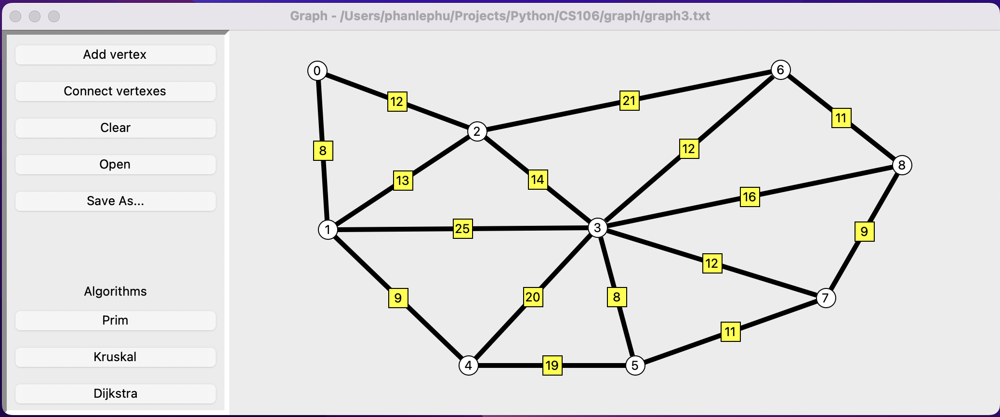

<!-- ABOUT THE PROJECT -->
## About The Project



The final project, I have built for the CS106 course. It helps to visualize how an algorithm(Prim, Kruskal, Dijkstra) works on an input graph.


### Built With

* Python 
* Tkinter


<!-- GETTING STARTED -->
## Getting Started

### Prerequisites

Installing python 3.x on your machine.

>**_NOTE:_**  From python 3.10, the Tkinter package is not included as a base package. So you have to install it later.


### Installation

1. Clone the repo
   ```sh
   git clone https://github.com/phan-le-phu/CS106.git
   ```
2. Change the current working director
   ```sh
   cd ./CS106
   ```
3. Run project
    ```sh
   python3 ./main.py
   ```


<!-- USAGE EXAMPLES -->
## Usage

Below are some demos of the features of this project.
Draw a graph.

Save and open a graph.

Run the Prim algorithm on the input graph.

Run the Kruskal algorithm on the input graph.

Run the Dijkstra algorithm on the input graph.
